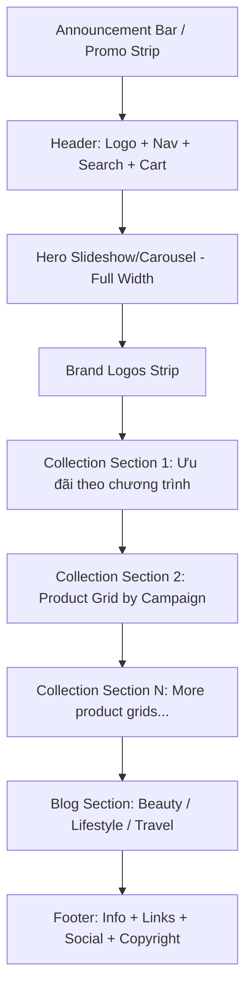
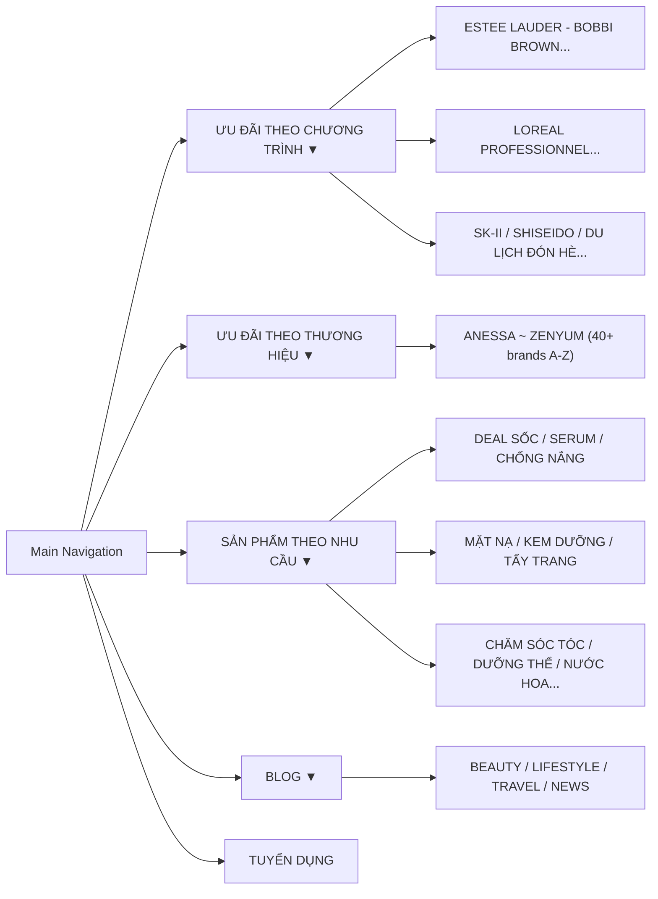

# Nghiên cứu Website hannaholala.com - Phân Tích Chuyên Sâu Full Stack

> **Ngày nghiên cứu:** 2026-04-18
> **Mục tiêu:** Phân tích toàn bộ thành phần kỹ thuật, thiết kế, UX/UI của [hannaholala.com](https://hannaholala.com/) để phục vụ dự án mth-web-interface.

---

## 1. Tổng Quan Website

| Hạng mục | Chi tiết |
|---|---|
| **Tên thương hiệu** | Hannah Olala |
| **Loại website** | E-commerce (Beauty & Lifestyle) |
| **Nền tảng** | **Haravan** (SaaS tương tự Shopify, phổ biến tại Việt Nam) |
| **CDN** | hstatic.net (CDN riêng của Haravan) |
| **Ngôn ngữ** | Tiếng Việt |
| **Mục tiêu** | Bán mỹ phẩm, skincare, lifestyle cao cấp cho phụ nữ Việt |

---

## 2. Design System

### 2.1 Bảng Màu (Color Palette)

| Token | Mã màu | Sử dụng |
|---|---|---|
| Primary Coral | `#F0ADA7` | Nút CTA "MUA NGAY", badge giảm giá, accent |
| Background | `#FFFFFF` | Nền chủ đạo toàn bộ website |
| Text Primary | `#000000` | Tiêu đề, body text chính |
| Text Secondary | `#666666` ~ `#999999` | Mô tả phụ, giá gốc (gạch ngang) |
| Divider | `#E0E0E0` | Đường kẻ phân cách giữa các section |
| Sale Red | `#FF0000` / `#E53935` | Giá sale, tag "SALE" |
| Header BG | `#FFFFFF` | Header trắng, clean |

### 2.2 Typography

| Element | Font | Weight | Size (ước lượng) |
|---|---|---|---|
| Logo | **Raleway** hoặc custom | 300-400 (Light) | ~28-32px |
| Navigation | **Raleway** | 600 (Semibold) | 13-14px, uppercase |
| Product Title | **Raleway** | 500-600 | 14-16px |
| Price | **Raleway** | 700 (Bold) | 16-18px |
| Body Text | **Raleway** | 400 (Regular) | 14-15px |
| CTA Button | **Raleway** | 600-700 | 14px, uppercase |

> [!TIP]
> **Raleway** là Google Font dạng Geometric Sans-serif, rất phù hợp cho thương hiệu Beauty/Luxury. Import từ Google Fonts.

### 2.3 Spacing & Grid

- **Container width:** ~1200px max-width (centered)
- **Product Grid:** 4-5 cột trên desktop, responsive xuống 2 cột trên mobile
- **Section gap:** ~40-60px giữa các section
- **Card padding:** ~15-20px

---

## 3. Cấu Trúc Layout Trang Chủ

### Các Section Chính:

1. **Top Bar:** Thanh thông báo khuyến mãi chạy ngang (announcement bar)  
2. **Header:** Logo "HANNAH OLALA" giữa, navigation bên trái, search + account + cart bên phải, social icons (FB, IG, YT)
3. **Hero Banner:** Slideshow full-width với dots navigation, ảnh campaign chất lượng cao
4. **Brand Logos:** Grid/strip hiển thị 80+ logo thương hiệu đối tác
5. **Product Collections:** Nhiều section, mỗi section 1 collection (DU LỊCH ĐÓN HÈ, SK-II, SHISEIDO...) với product cards + nút "Xem Thêm"
6. **Footer:** 
   - Cột liên kết dịch vụ (Hướng dẫn mua hàng, Thanh toán, Vận chuyển, Đổi trả, Bảo mật)
   - Tagline sứ mệnh
   - Nút "Back to Top"

---

## 4. Navigation System (Mega-Menu)

- **Kiểu:** Multi-level dropdown (mega-menu), mở khi hover
- **Desktop:** Dropdown panel hiển thị danh sách link, không có image/banner trong dropdown
- **Mobile:** Accordion-style menu

---

## 5. Product Card Component

| Thành phần | Mô tả |
|---|---|
| **Ảnh sản phẩm** | Tỷ lệ vuông/gần vuông, nền trắng |
| **Badge** | Tag "SALE" hoặc "%" giảm giá (nếu có), màu đỏ/coral |
| **Tên sản phẩm** | Uppercase, multi-line, font Raleway 500 |
| **Giá gốc** | Gạch ngang, màu xám |
| **Giá sale** | Bold, màu đỏ/đen đậm |
| **Nút CTA** | "MUA NGAY" - xuất hiện khi hover, màu coral `#F0ADA7` |
| **Hover effect** | Nút MUA NGAY slide up / fade in |

---

## 6. Phân Tích Kỹ Thuật (Technical Deep Dive)

### 6.1 Frontend Stack

| Công nghệ | Chi tiết |
|---|---|
| **HTML** | Liquid template engine (Haravan/Shopify-like) |
| **CSS** | Vanilla CSS, inline styles, Flexbox + Grid |
| **JavaScript** | jQuery 1.11.0 (phiên bản cũ) |
| **Layout** | CSS Flexbox cho nav, CSS Grid cho product listing |
| **Responsive** | Media queries, mobile-first indicators |
| **Image Format** | Chủ yếu JPG/PNG, có sử dụng thẻ `<picture>`, chưa tối ưu WebP |
| **Lazy Loading** | Có, cơ bản (native `loading="lazy"` hoặc JS-based) |

### 6.2 Performance & Optimization

| Kỹ thuật | Trạng thái |
|---|---|
| **CDN** | ✅ hstatic.net (Haravan CDN) |
| **Image Lazy Load** | ✅ Có |
| **WebP Format** | ⚠️ Không hoàn toàn (vẫn dùng JPG/PNG nhiều) |
| **CSS Minification** | ⚠️ Một phần |
| **JS Minification** | ⚠️ Một phần |
| **Critical CSS** | ❌ Không rõ |
| **Preconnect/Preload** | ⚠️ Cơ bản |
| **Service Worker** | ❌ Không |

### 6.3 SEO

| Yếu tố | Trạng thái |
|---|---|
| **Title Tag** | ✅ "Hannah Olala" |
| **Meta Description** | ✅ Có mô tả tiếng Việt |
| **OG Tags** | ✅ Có (Open Graph cho social sharing) |
| **H1 Tag** | ❌ **THIẾU** - lỗi SEO nghiêm trọng |
| **Semantic HTML** | ⚠️ Trung bình (dùng div nhiều) |
| **Structured Data** | ⚠️ Không rõ schema.org |
| **Sitemap/Robots.txt** | ✅ Mặc định Haravan |

### 6.4 Third-Party Integrations

| Tool | Mục đích |
|---|---|
| **Meta Pixel (Facebook)** | Retargeting ads, conversion tracking |
| **TikTok Pixel** | TikTok ads tracking |
| **Haravan Analytics** | Built-in e-commerce analytics |
| **Social Links** | Facebook, Instagram, YouTube (icon trên header) |

---

## 7. Animation & Interaction Patterns

| Element | Animation | CSS/JS |
|---|---|---|
| **Hero Slideshow** | Auto-play slide, dot navigation | JS slideshow (built-in Haravan) |
| **Product hover** | CTA button fade-in/slide-up | CSS transition |
| **Dropdown menu** | Fade/slide down on hover | CSS transition + JS |
| **Back to Top** | Fixed position, click scroll | JS smooth scroll |
| **Image loading** | Fade-in on lazy load | CSS opacity transition |
| **Page transitions** | Không có (standard page reload) | N/A |
| **Scroll animations** | ❌ Không có (AOS, GSAP etc.) | N/A |
| **Micro-animations** | ❌ Rất ít, website khá "tĩnh" | N/A |

> [!IMPORTANT]
> Website hiện tại **rất ít animation**. Đây là điểm có thể cải thiện mạnh nếu xây dựng lại: thêm scroll reveal (AOS/GSAP), hover micro-interactions, page transitions.

---

## 8. Responsive Design Analysis

| Breakpoint | Behavior |
|---|---|
| **Desktop (>1200px)** | Full layout, 4-5 product columns, mega-menu hover |
| **Tablet (768-1200px)** | Giảm columns, menu hamburger |
| **Mobile (<768px)** | 2 columns, accordion menu, search sticky, simplified header |

---

## 9. Đánh Giá Chuyên Gia & Khuyến Nghị Cho Dự Án Mới

### ✅ Điểm mạnh cần học hỏi:
1. **Clean, minimalist design** - Nền trắng tạo không gian cho sản phẩm nổi bật
2. **Mega-menu phân loại rõ ràng** - 3 chiều: Chương trình, Thương hiệu, Nhu cầu
3. **CTA coral nổi bật** - Nút MUA NGAY dễ nhận diện, tăng conversion
4. **Brand trust strip** - 80+ logo brands tạo uy tín ngay lập tức
5. **Social integration** - FB, IG, YT ngay trên header

### ⚠️ Điểm yếu cần tránh/cải thiện:
1. **jQuery cũ (1.11)** → Dùng Vanilla JS hoặc framework hiện đại
2. **Thiếu WebP** → Bắt buộc dùng WebP + fallback
3. **Thiếu H1** → SEO kỹ thuật phải chuẩn từ đầu
4. **Ít animation** → Thêm scroll reveal, hover effects, micro-interactions
5. **Không có skeleton loading** → Thêm cho UX tốt hơn
6. **Semantic HTML yếu** → Dùng đúng `<header>`, `<nav>`, `<main>`, `<section>`, `<article>`, `<footer>`

---

## 10. Đánh Giá Bổ Sung (Theo Tiêu Chuẩn UI/UX Pro Max)

Sau khi quét chuyên sâu qua `ui-ux-pro-max`, giao diện gốc bộc lộ các vấn đề thiếu chuẩn xác sau, cần được khắc phục 100% trên `mth-web-interface`:

### 10.1. Hệ thống Icon (Iconography)
- **Tình trạng mẫu:** Không có hệ thống icon đồng bộ, sử dụng font icons đời cũ, không resize responsive. 
- **Giải pháp cho dự án mới:** Bắt buộc dùng hệ thống SVG icons (như *Lucide* hoặc *Heroicons*). Phải dùng `viewBox` cố định (vd: 24x24) và class kích thước đồng nhất (vd: `w-6 h-6`). Tuyệt đối không dùng emojis cho UI.

### 10.2. Chế độ ánh sáng & Tương phản (Light/Dark Mode)
- **Tình trạng mẫu:** Chỉ có Light Mode, một số cụm text phụ màu quá xám dẫn đến độ tương phản (Contrast Ratio) thấp, vi phạm quy tắc khả năng đọc.
- **Giải pháp cho dự án mới:** Thiết lập tỷ lệ tương phản tối thiểu 4.5:1. Text trên nền sáng phải dùng màu sắc đậm (từ `slate-600` đến `slate-900`). Glassmorphism tĩnh trên light mode cần đạt tối thiểu `bg-white/80`. Không cần dark mode toàn diện nhưng hệ màu Light Mode bắt buộc phải đạt độ rõ nét tuyệt đối.

### 10.3. Đổ bóng & Bo góc (Radius & Shadows)
- **Tình trạng mẫu:** Bóng đổ Card/Button bị cứng (solid), thiếu phân lớp shadow, border hơi nhạt nhòa.
- **Giải pháp cho dự án mới:** Nâng cấp phong cách đổ bóng đa tầng (multi-layer shadow) giúp nổi khối luxury. Quản lý độ bo góc tinh tế (`rounded-md` hoặc `rounded-lg`).

### 10.4. Tương tác vi mô & Trạng thái hoạt động (Micro-Interactions)
- **Tình trạng mẫu:** Một số thành phần tương tác thiếu con trỏ chuột chuẫn (`cursor-default` thay vì `pointer`), hiệu ứng hover đôi khi làm rung lắc nhẹ thiết kế (layout shift).
- **Giải pháp cho dự án mới:** 100% element có thể click phải có `cursor-pointer`. Tốc độ transition (color/opacity) phải dao động trong khoảng 150ms-300ms liên tục và mượt mà. Quá trình hover không phóng to box-sizing gây đẩy phần tử xung quanh.

### 10.5. Khả năng truy cập chuẩn hóa (Accessibility)
- **Tình trạng mẫu:** Thiếu thẻ `<label>` cho form tìm kiếm/đăng nhập, thiếu `aria-label` cho một vài icon button (Hamburger Menu).
- **Giải pháp cho dự án mới:** Focus state phải hiển thị rõ khi người dùng sử dụng phím `Tab` trên bàn phím. Các button chỉ có icon buộc phải có `aria-label` tường minh. Thêm `@media (prefers-reduced-motion)` để tắt bớt hiệu ứng bay lượn nếu hệ điều hành cấu hình giảm chuyển động.

---

## 11. Tóm Tắt Định Hướng Mới Cho mth-web-interface

Từ nghiên cứu và áp dụng chuẩn `ui-ux-pro-max`, dự án mới nên:
- Thừa hưởng hệ thống lưới **Clean & Minimalist** của trang gốc, nhưng nâng cấp UI Elements bằng phong cách **Liquid Glass** đẳng cấp hơn.
- Font chữ: **Playfair Display** (Heading) & **Inter** (Body) - Chuẩn form mỹ phẩm Luxury & dễ đọc.
- Màu: Tông nền trắng/kem chủ đạo + Mực chữ đậm (`slate-900`/`#1C1917`) + Accent (Màu Coral hoặc màu thương hiệu của Mai Trinh).
- Layout: CSS Grid + Flexbox, ưu tiên responsive hoàn hảo tại các mốc `375px`, `768px`, `1024px`, `1440px`.
- UX: 100% element tương tác có visual feedback mượt mà (150-300ms).
- Stack: HTML/CSS/Vanilla JS (tuân thủ SEO sematics HTML5, minified assets, lazy loading ảnh chuẩn WebP).
